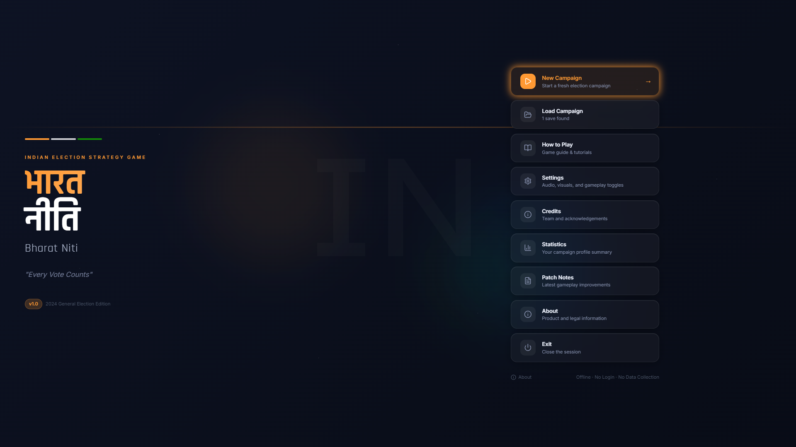
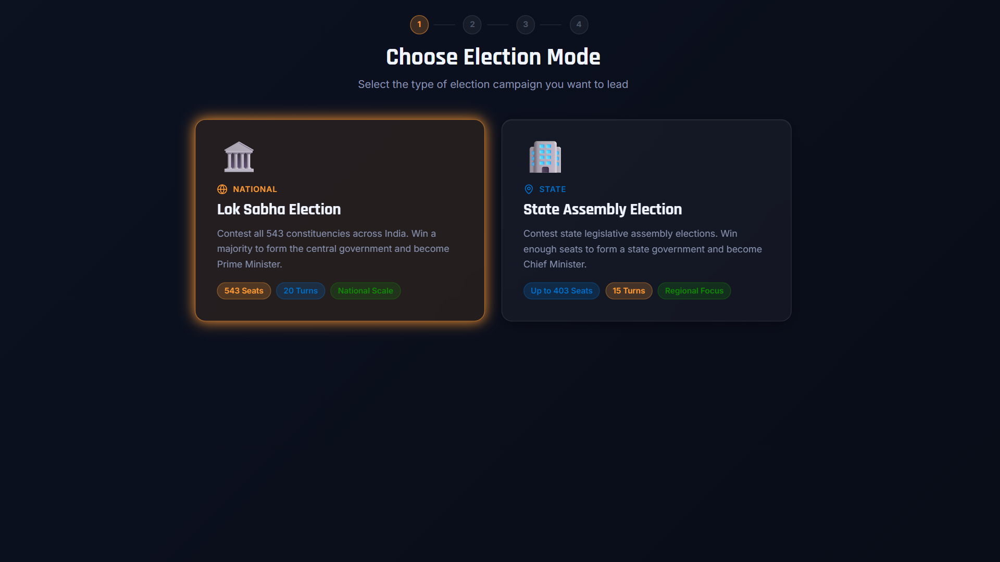
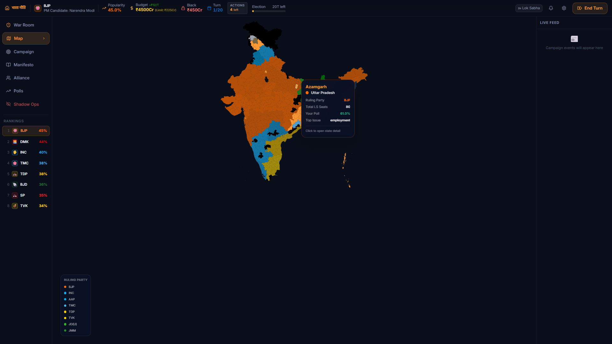
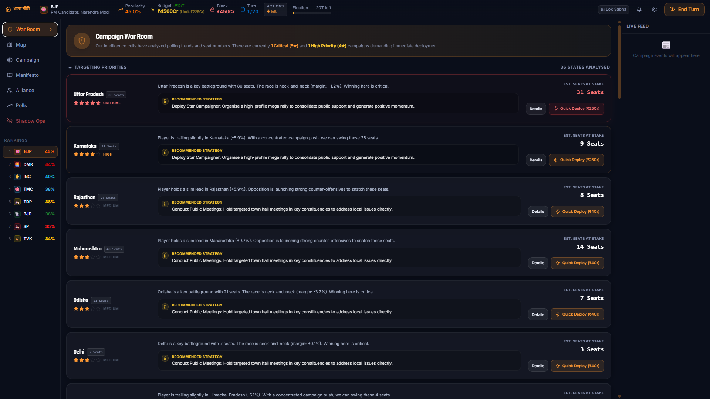
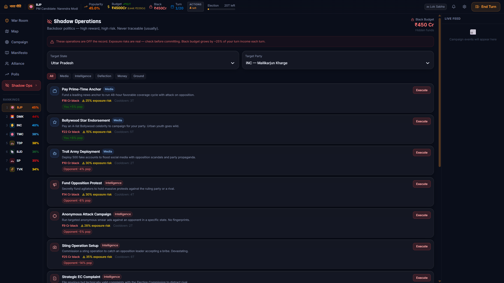
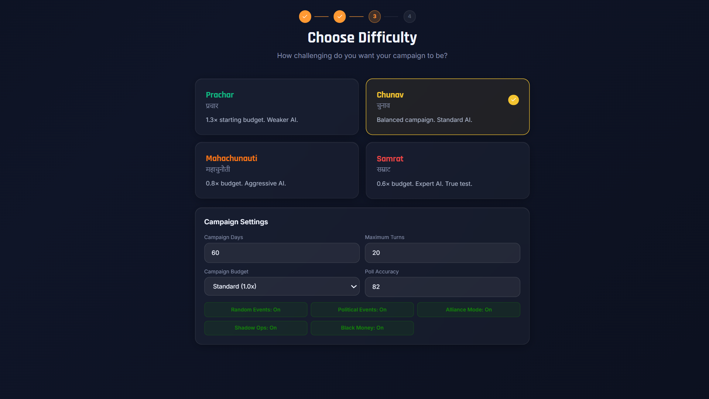

# Bharat Niti

> A browser-based Indian political strategy and election simulation game inspired by India's democratic process.

---

# Demo Link
https://bharat-niti.vercel.app/

---

## 📖 About

**Bharat Niti** is a turn-based political strategy game where players manage election campaigns, form alliances, respond to dynamic political events, and compete against intelligent AI to win Lok Sabha and State Assembly elections.

Built with **React**, **TypeScript**, **Vite**, **Zustand**, **Tailwind CSS**, and **Framer Motion**.

---

## 📸 Screenshots

| Main Menu | Game Setup |
|:---------:|:----------:|
|  |  |
| **Main Menu** | **New Game Setup** |

| Dashboard | War Room |
|:---------:|:--------:|
|  |  |
| **Campaign Dashboard** | **Campaign War Room** |

| Shadow Operations | Settings |
|:-----------------:|:--------:|
|  |  |
| **Shadow Operations** | **Game Settings** |

---

## ✨ Features

- 🗳️ Lok Sabha Election Mode
- 🏛️ State Assembly Election Mode *(In Development)*
- 🤝 Dynamic Alliance & Seat Sharing
- 🗺️ Interactive India Map
- 📍 Constituency-Level Campaigning
- 🧠 Intelligent AI Opponents
- 📊 Opinion Polls & Exit Polls
- ⚡ Dynamic Political Event Engine
- 🎯 Campaign War Room
- 💰 Campaign Budget & Resource Management
- 📈 Realistic Election Simulation
- 💾 Save & Resume Campaigns
- 🌐 Fully Offline Browser Experience

---

## 🛠️ Tech Stack

- React
- TypeScript
- Vite
- Zustand
- Tailwind CSS
- Framer Motion

---

## 🚀 Getting Started

Clone the repository

```bash
git clone https://github.com/umarmahtab/indian-political-simulator.git
```

Navigate to the project

```bash
cd indian-political-simulator
```

Install dependencies

```bash
npm install
```

Run the development server

```bash
npm run dev
```

Build for production

```bash
npm run build
```

---

## 🗺️ Roadmap

- ✅ Lok Sabha Campaign
- ✅ AI Election Simulation
- ✅ Dynamic Political Events
- ✅ Interactive India Map
- 🚧 State Assembly Mode
- 🚧 District-Level Campaigning
- 🚧 Enhanced AI Strategy
- 🚧 Expanded Political Event Database

---

## 🚧 Development Status

**Bharat Niti** is currently in **active development**.

The project is in an early build and should not yet be considered a finished product. Many gameplay systems, AI mechanics, election simulations, balancing, UI elements, and quality-of-life improvements are still under development. You may encounter bugs, incomplete features, temporary assets, or gameplay changes as the project evolves.

The project is continuously being refined with the goal of delivering a polished and immersive political strategy experience.

---

## 📄 Disclaimer

**Bharat Niti** is a fictional strategy game inspired by India's democratic process and is created solely for entertainment and educational purposes. Any resemblance between in-game outcomes and real-world events is purely coincidental.

---

## ⭐ Support

If you enjoyed the project, consider giving it a ⭐ on GitHub!
